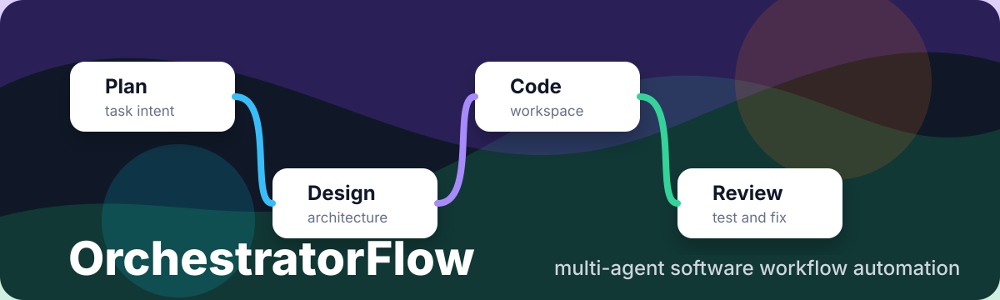
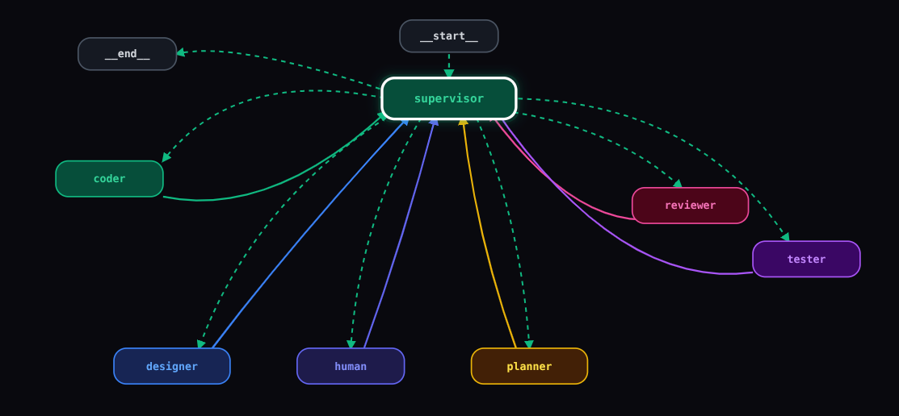

<p align="center">
  
</p>

<p align="center">
  <a href="https://www.python.org/downloads/"></a>
  <a href="https://github.com/langchain-ai/langgraph"></a>
  
  
</p>

# OrchestratorFlow

OrchestratorFlow is a LangGraph-powered multi-agent coding workflow. It routes a user task through specialist agents for intake, planning, design, implementation, review, testing, and human clarification when the request is ambiguous.

The project is built for local development first: generated projects are written into a local `workspace/` folder, secrets stay in `.env`, and runtime state is ignored so the repository remains clean when pushed to GitHub.

## What It Does

- Routes simple tasks directly to implementation.
- Routes complex tasks through planner and designer agents before code generation.
- Uses reviewer and tester feedback loops to improve generated projects.
- Supports Google Gemini by default and OpenAI models as an alternative provider.
- Includes a Rich terminal UI for readable workflow progress.
- Keeps generated runs outside Git through a production-focused `.gitignore`.

> [!TIP]
> 💬 **Have feedback or suggestions?**
>
> If you find a bug, have an idea for a new feature, or think something can be improved, please **open an Issue**.
>
> Your feedback helps make **OrchestratorFlow** better for everyone. 🚀
## Repository Layout

```text
orchestratorflow/
├── agents/             # Planner, designer, coder, reviewer, tester, human, supervisor
├── graph/              # LangGraph workflow construction
├── prompts/            # System prompts used by each agent
├── tools/              # Code execution helpers
├── ui/cli/             # Rich terminal UI
├── site/               # React/Vite GitHub Pages site
├── studio/             # LangGraph Studio entrypoint
├── README_assets/      # Images used by this README
├── paper.pdf           # Project paper/reference document
├── .env.example        # Safe environment template
├── pyproject.toml      # Package metadata and CLI entrypoint
└── requirements.txt    # Runtime dependencies
```

## Quick Start

### 1. Create a virtual environment

```bash
python -m venv .venv
source .venv/bin/activate
```

On Windows PowerShell:

```powershell
python -m venv .venv
.\.venv\Scripts\Activate.ps1
```

### 2. Install dependencies

```bash
python -m pip install --upgrade pip
python -m pip install -e ".[dev]"
```

If you prefer the requirements file:

```bash
python -m pip install -r requirements.txt
```

### 3. Configure environment variables

```bash
cp .env.example .env
```

Add your API keys to `.env`.

For Google Gemini:

```env
LLM_PROVIDER=google
LLM_MODEL=gemini-2.5-flash
GEMINI_API_KEY=your_key_here
GOOGLE_API_KEY=your_key_here
```

For OpenAI:

```env
LLM_PROVIDER=openai
LLM_MODEL=gpt-4.1-mini
OPENAI_API_KEY=your_key_here
```

### 4. Run the CLI

```bash
orchestratorflow "Build a Python CLI todo app with tests"
```

Debug routing and state changes:

```bash
orchestratorflow --debug "Create a small FastAPI health-check service"
```

You can also run the module directly:

```bash
python -m orchestratorflow.ui.cli "Build a CSV cleaner script"
```

During local development, this equivalent path also works from the repository root:

```bash
python ui/cli "Build a CSV cleaner script"
```

## GitHub Pages UI

The repository includes a production-ready React/Vite site in `site/`.

Run it locally:

```bash
cd site
npm install
npm run dev
```

Build it for GitHub Pages:

```bash
npm run build
```

The Vite base path is configured for this repository:

```text
/orchestratorflow/
```

Pushing to `main` triggers `.github/workflows/pages.yml`, which builds `site/` and deploys `site/dist` to GitHub Pages.

## LangGraph Studio
<p align="center">
  
</p>

The Studio graph entrypoint is in `studio/Agent.py`, with configuration in `studio/langgraph.json`.

From the repository root:

```bash
cd studio
langgraph dev
```

Studio runtime data is generated under `studio/.langgraph_api/` and is intentionally ignored by Git.

## Generated Output

OrchestratorFlow writes generated projects to:

```text
workspace/run_001/
workspace/run_002/
...
```

These folders are local build artifacts. They are ignored because they can contain generated code, dependency files, logs, and experiment output that should not be committed unless intentionally promoted into the main codebase.

## Paper

The project paper is included as:

```text
paper.pdf
```

Use this file for academic context, architecture notes, or project background when presenting the repository.

## Production Repository Hygiene

Before pushing:

```bash
git status --short
```

Expected tracked source files include Python modules, prompts, README assets, `paper.pdf`, and repository configuration. Local-only files such as `.env`, `workspace/`, `__pycache__/`, `.pytest_cache/`, virtual environments, logs, and LangGraph runtime state should remain untracked.

If secrets were ever committed, rotate them immediately and remove them from Git history before making the repository public.

## Testing

Run tests with:

```bash
pytest
```

At the moment, generated projects may contain their own tests inside `workspace/`, but those generated runs are intentionally ignored. Add permanent repository tests under a root `tests/` directory when hardening core workflow behavior.

## Maintenance Notes

- Keep `.env.example` updated whenever a new environment variable is introduced.
- Keep generated projects in `workspace/` unless they are intentionally promoted.
- Do not commit LangGraph runtime checkpoints or local Studio state.
- Prefer small, focused commits for agent, graph, prompt, and UI changes.
- Review `git status --short` before every push.
